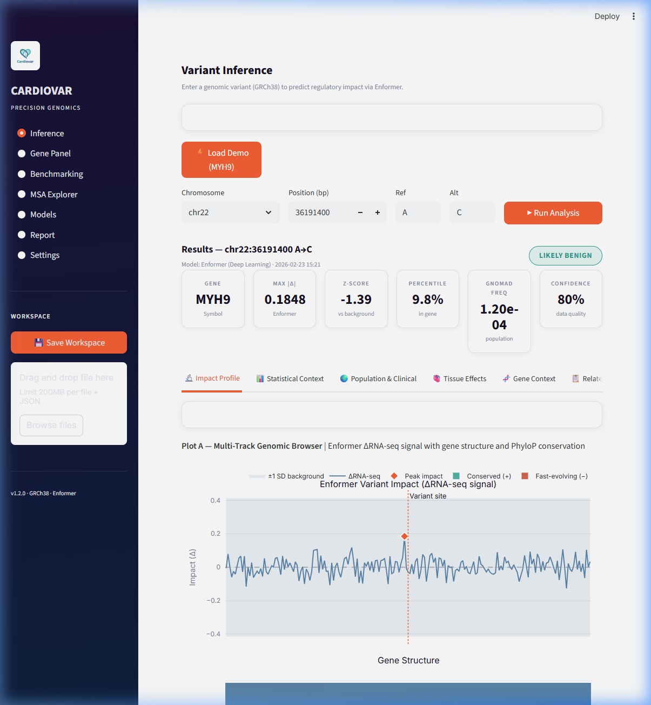
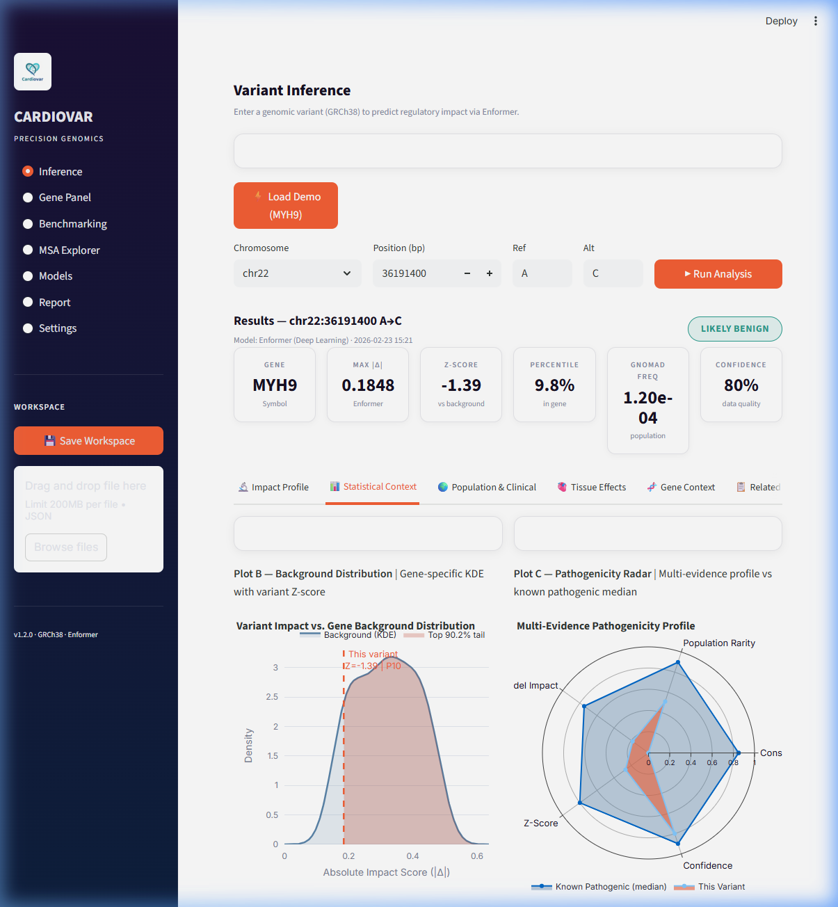
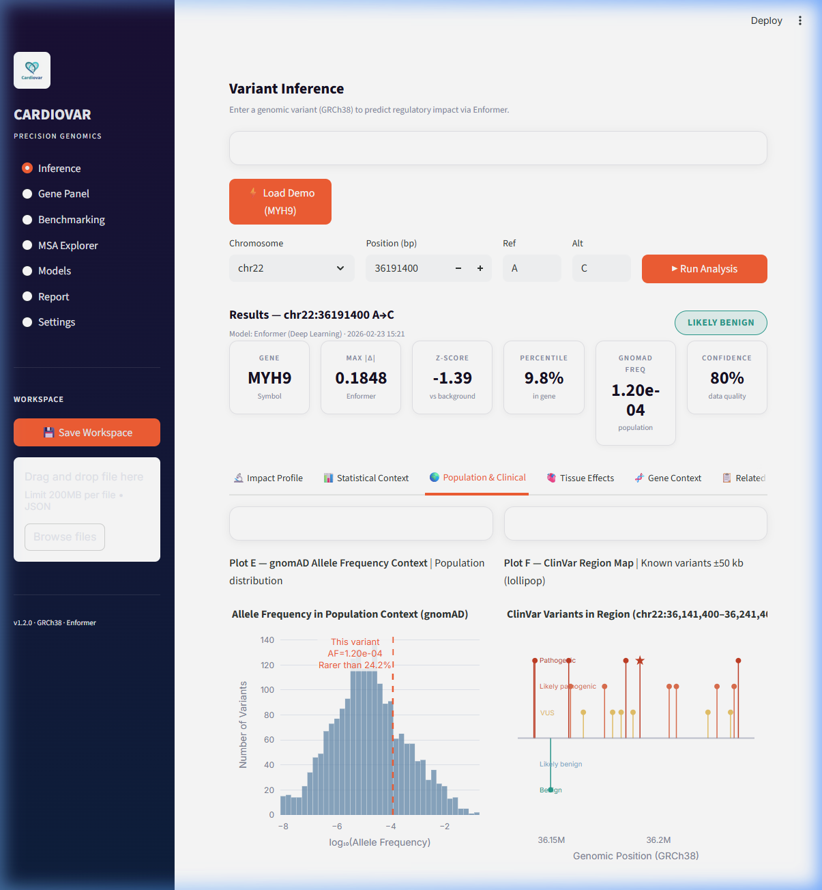
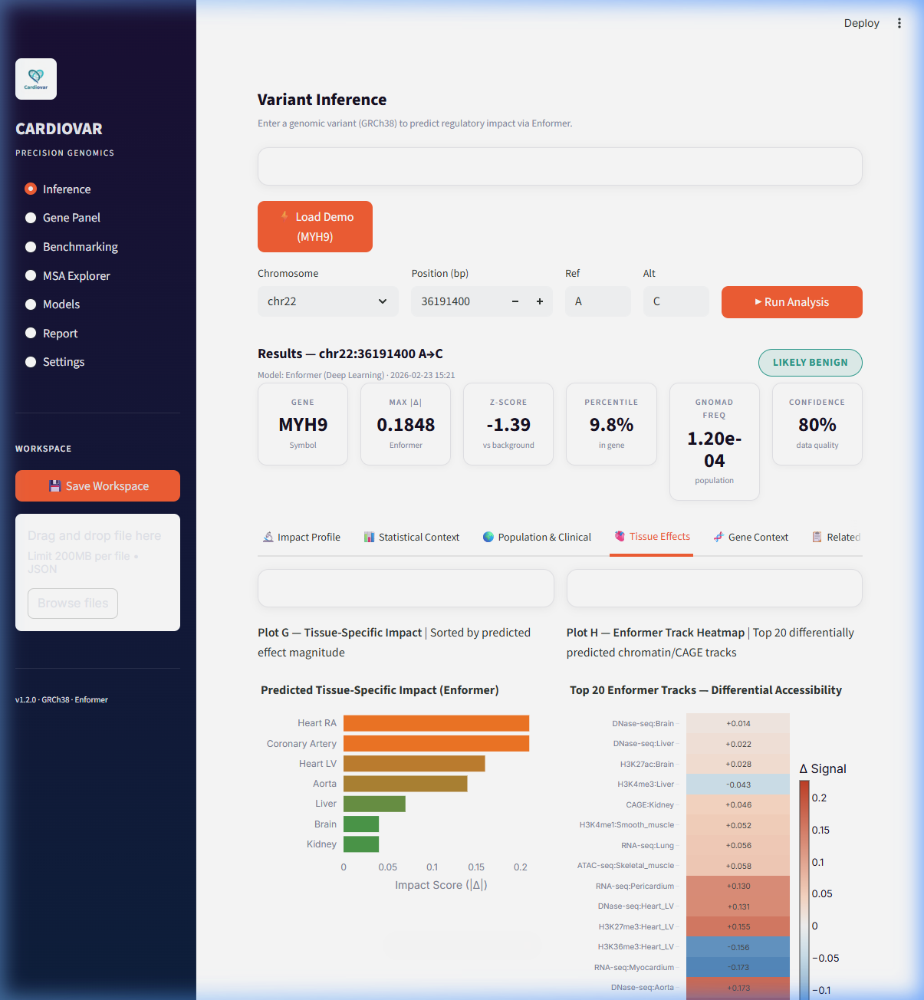
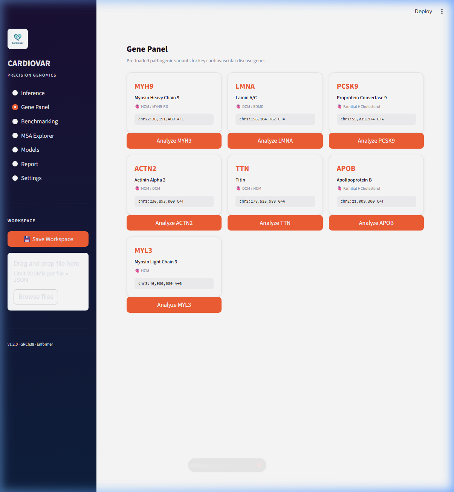

<div align="center">


# CardioVar

**Precision genomics platform for cardiovascular variant interpretation**

[](https://www.python.org/)
[](LICENSE)
[](https://github.com/deepmind/deepmind-research/tree/master/enformer)
[](https://www.ncbi.nlm.nih.gov/datasets/genome/GCF_000001405.40/)

> ⚠️ **Research use only.** Not intended for clinical diagnosis or patient care.

</div>

---

## Overview

**CardioVar** predicts the regulatory impact of genomic variants in cardiomyopathy-relevant genes using [Enformer](https://www.nature.com/articles/s41592-021-01252-x) — a state-of-the-art transformer-based deep learning model that maps 196 kb DNA sequences to 5,313 epigenomic assay tracks.

The platform combines Enformer predictions with live population genomics (gnomAD v4), evolutionary conservation (UCSC PhyloP), tissue expression (GTEx v8), and clinical annotations (ClinVar) into a unified interactive dashboard.

---

## Screenshots

### Variant Inference — Metrics + Multi-Track Genomic Browser


*Metric tiles (Gene · Max |Δ| · Z-Score · Percentile · gnomAD Freq · Confidence) + Plot A: ΔRNA-seq profile with ±1 SD background ribbon, gene structure track, and PhyloP conservation.*

---

### Statistical Context — Background KDE + Pathogenicity Radar


*Plot B: Variant impact vs. gene-specific background distribution (KDE) with Z-score annotation. Plot C: 5-axis radar chart comparing the variant's evidence profile to the known-pathogenic median.*

---

### Population & Clinical Context — gnomAD + ClinVar Lollipop


*Plot E: Variant allele frequency in the gnomAD population context. Plot F: ClinVar lollipop map of all known variants in the ±50 kb region, colored by pathogenicity classification.*

---

### Tissue Effects — GTEx Expression + Enformer Track Heatmap


*Plot G: Tissue-specific impact sorted by magnitude (real GTEx v8 expression scaled by Enformer Δ). Plot H: Top-20 differentially predicted Enformer tracks (diverging blue/red heatmap).*

---

### Gene Panel


*Pre-loaded pathogenic variants for 7 key cardiovascular genes — single click to load and analyze.*

---

## Features

| Feature | Details |
|:---|:---|
| **Deep Learning Inference** | Enformer transformer (GPU-accelerated, 196 kb context) |
| **8 Scientific Plots** | Genomic browser, KDE, Radar, Evidence stack, gnomAD AF, ClinVar lollipop, GTEx heatmap, Enformer tracks |
| **Classification Badge** | LIKELY PATHOGENIC / VUS / LIKELY BENIGN from multi-evidence heuristic |
| **Population Context** | gnomAD v4 allele frequency (real API with caching) |
| **Conservation** | UCSC PhyloP 100-way vertebrate scores |
| **Tissue Expression** | GTEx v8 median TPM (real API) scaled by Enformer delta |
| **Gene Panel** | 7 curated HCM/DCM genes with canonical pathogenic variants |
| **Batch Analysis** | CSV / VCF upload, async queue, downloadable results |
| **MSA Explorer** | FASTA alignment upload, similarity matrix, Shannon entropy plot |
| **Workspace Save/Load** | JSON export/import of session state |
| **HTML Report** | Downloadable variant report with full metrics |

---

## Data Sources

| Source | Type | Used for |
|:---|:---|:---|
| **Enformer** (Avsec et al. 2021) | Real (GPU) | ΔRNA-seq impact profile |
| **gnomAD v4** | Real API | Allele frequency |
| **UCSC PhyloP** | Real API | Conservation track |
| **GTEx v8** | Real API | Tissue expression heatmap |
| **Ensembl REST** | Real API | Gene annotations, exon structure |
| **ClinVar (NCBI)** | Real API | Clinical variant associations |
| **Background KDE** | Pre-computed | Gene-specific percentile/Z-score |

---

## Quick Start

### Requirements

- Python 3.11+
- NVIDIA GPU recommended (CPU fallback available)

### Install

```bash
git clone https://github.com/QntmSeer/CardioVar.git
cd CardioVar
pip install -r requirements.txt
```

### Run

```bash
# Terminal 1 — Backend
python -m uvicorn api:app --host 127.0.0.1 --port 8000

# Terminal 2 — Dashboard
streamlit run dashboard.py
```

Open **http://localhost:8501** in your browser.

### Windows one-liner

```powershell
.\start_local.ps1
```

---

## API Reference

### `POST /variant-impact`

```json
{
  "assembly": "GRCh38",
  "chrom": "chr22",
  "pos": 36191400,
  "ref": "A",
  "alt": "C"
}
```

**Response** includes: `metrics`, `curve` (x/y), `tracks` (exons, conservation), `tissue_effects`, `background_distribution`, `gene`, `data_sources`.

### `GET /system-status`

Returns GPU availability, model load status, and API connectivity.

### `POST /batch-start` + `GET /batch-status/{id}`

Submit and poll a batch variant analysis job.

---

## Project Structure

```
CardioVar/
├── api.py                  # FastAPI backend (REST endpoints)
├── api_integrations.py     # gnomAD, GTEx, UCSC, Ensembl, ClinVar clients
├── api_cache.py            # SQLite-backed API response cache (24h TTL)
├── dashboard.py            # Streamlit frontend
├── plots.py                # 8 Plotly scientific visualization functions
├── variant_engine.py       # Core variant impact computation
├── enformer_wrapper.py     # Enformer GPU inference wrapper
├── vcf_parser.py           # VCF file ingestion
├── utils.py                # CLI utilities
├── main.py                 # CLI entry point
├── data/                   # Reference data & SQLite cache
├── docs/screenshots/       # App screenshots
├── tests/                  # Unit & integration tests
└── requirements.txt
```

---

## Supported Gene Panel

| Gene | Disease | Variant |
|:---|:---|:---|
| **MYH9** | HCM / MYH9-RD | chr22:36191400 A→C |
| **LMNA** | DCM / EDMD | chr1:156104762 G→A |
| **PCSK9** | Familial Hypercholesterolemia | chr1:55039974 G→A |
| **ACTN2** | HCM / DCM | chr1:236893000 C→T |
| **TTN** | DCM / HCM | chr2:178525989 G→A |
| **APOB** | Familial Hypercholesterolemia | chr2:21009300 C→T |
| **MYL3** | HCM | chr3:46900000 A→G |

---

## Citation

If you use CardioVar in your research, please cite:

```
CardioVar v1.2 — Precision genomics for cardiovascular variant interpretation.
GitHub: https://github.com/QntmSeer/CardioVar
```

Enformer model: Avsec et al. (2021). *Effective gene expression prediction from sequence by integrating long-range interactions*. Nature Methods. https://doi.org/10.1038/s41592-021-01252-x

---

## License

Apache License 2.0 — see [LICENSE](LICENSE).

> **Disclaimer:** CardioVar is for research and educational purposes only and does not constitute medical advice.
